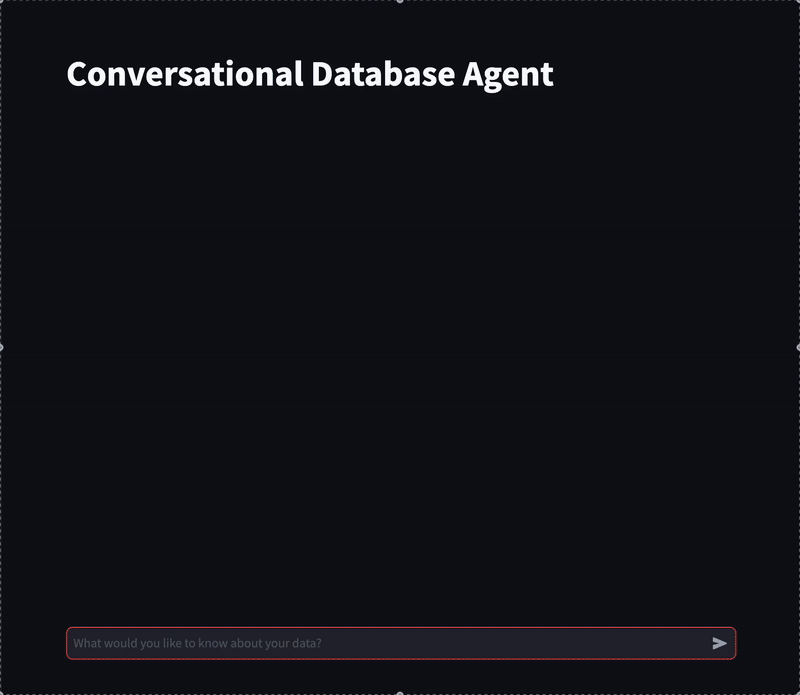

# Database Agent

A conversational AI agent for PostgreSQL databases, inspired by Pandas AI. This agent allows users to interact with their PostgreSQL database using natural language, without needing to write SQL queries.

## Features

- **Natural Language to SQL:** Converts natural language questions into SQL queries
- **Data Visualization:** Generates charts and graphs from query results
- **Query Routing:** Intelligently routes queries to specialized handlers
- **User-Friendly Interface:** Simple chat interface for interacting with your data
- **PostgreSQL Integration:** Works directly with your PostgreSQL database

## Demo
### Understands the context


### Asks clarifying questions when faced with an ambiguous query


## Architecture

The system consists of the following main components:

1. **Central Query Router:** Analyzes user queries and routes them to specialized agents
   - Uses LLM to classify query intent
   - Routes to the appropriate specialized agent
   - Maintains conversation context

2. **Text2SQL Agent:** Converts natural language to SQL
   - Generates SQL based on natural language input
   - Validates queries before execution
   - Provides explanations for generated SQL

3. **Visualization Agent:** Creates visual representations of data
   - Selects appropriate visualization types
   - Generates visualization code
   - Renders interactive charts

4. **Chat Agent:** Handles general conversational queries
   - Answers questions about the database
   - Provides system usage guidance
   - Maintains conversation context

5. **PostgreSQL Connector:** Securely executes queries against the database
   - Manages database connections
   - Executes SQL queries with timeout handling
   - Retrieves schema information
   - Formats query results

6. **Streamlit UI:** Provides a user-friendly interface
   - Chat-like interface for natural conversation
   - Displays query results and visualizations
   - Handles user input and system responses

## Getting Started

### Prerequisites

- Python 3.8+
- PostgreSQL database
- OpenAI API key (or another LLM provider)

### Installation

1. Clone this repository
```bash
git clone https://github.com/aspisov/database-agent.git
cd database-agent
```

2. Create a virtual environment

```bash
python -m venv venv
source venv/bin/activate  # On Windows: venv\Scripts\activate
```

3. Install dependencies
```bash
pip install -r requirements.txt
```

4. Set up your environment variables by creating a `.env` file:

```
# Database settings
DB_HOST=localhost
DB_PORT=5432
DB_NAME=your_database
DB_USER=your_username
DB_PASSWORD=your_password
DB_SCHEMA=public

# OpenAI settings
OPENAI_API_KEY=your_openai_api_key
LOGIC_MODEL=gpt-4o-mini
GENERATION_MODEL=gpt-4o-mini
```

### Running the Application

Start the application with:

```bash
python run_streamlit.py
```

The Streamlit UI will open in your default web browser.

### Using Docker

You can also run the application using Docker:

```bash
docker-compose up -d
```

This will start both the application and a PostgreSQL database.

## Usage Examples

Here are some examples of queries you can ask the system:

### SQL Queries
- "Show me the top 10 customers by total purchase amount"
- "What were the sales figures for each product category last month?"
- "Find all employees who have been with the company for more than 5 years"
- "What's the average order value by region?"

### Visualization Requests
- "Create a bar chart of monthly sales for the past year"
- "Show me a pie chart of customer distribution by country"
- "Visualize the trend of new user registrations over time"
- "Generate a scatter plot comparing product price vs. sales volume"

### General Questions
- "What tables are available in the database?"
- "How many records are in the customers table?"
- "What columns are in the orders table?"
- "Explain the relationship between customers and orders"

## Project Structure

```
database-agent/
├── .env                    # Environment variables
├── .gitignore              # Git ignore file
├── Dockerfile              # For containerizing the application
├── docker-compose.yml      # For local development with PostgreSQL
├── README.md               # Project documentation
├── requirements.txt        # Python dependencies
├── setup.py                # For packaging the application
├── run_streamlit.py        # Entry point for running the Streamlit app
├── tests/                  # Test directory
│   ├── __init__.py
│   ├── conftest.py         # Pytest fixtures
│   ├── test_agents/        # Tests for agents
│   ├── test_database/      # Tests for database connections
│   └── test_ui/            # Tests for UI components
├── docs/                   # Documentation
│   └── design_document.md  # Detailed design document
├── config/                 # Configuration
│   ├── __init__.py
│   └── settings.py         # Application settings
└── src/                    # Source code
    ├── __init__.py
    ├── agents/             # Agent modules
    │   ├── __init__.py
    │   ├── base.py         # Base agent class
    │   ├── router.py       # Query router agent
    │   ├── text2sql.py     # Text2SQL agent
    │   ├── visualization.py # Visualization agent
    │   └── chat.py         # Chat agent
    ├── database/           # Database operations
    │   ├── __init__.py
    │   └── connector.py    # Database connector
    ├── models/             # Data models
    │   ├── __init__.py
    │   ├── response.py     # Response models
    │   └── context.py      # Context models
    ├── prompts/            # LLM prompts
    │   ├── __init__.py
    │   ├── router_prompts.py
    │   ├── text2sql_prompts.py
    │   └── visualization_prompt.py
    ├── ui/                 # User interface
    │   ├── __init__.py
    │   └── streamlit_app.py # Streamlit app
    └── utils/              # Utility functions
        ├── __init__.py
        └── dataframe_utils.py # DataFrame utilities
```

## License

MIT

## Acknowledgments

- Inspired by [Pandas AI](https://github.com/gventuri/pandas-ai)
- Uses [OpenAI](https://openai.com/) for natural language processing
- Built with [Streamlit](https://streamlit.io/) for the UI