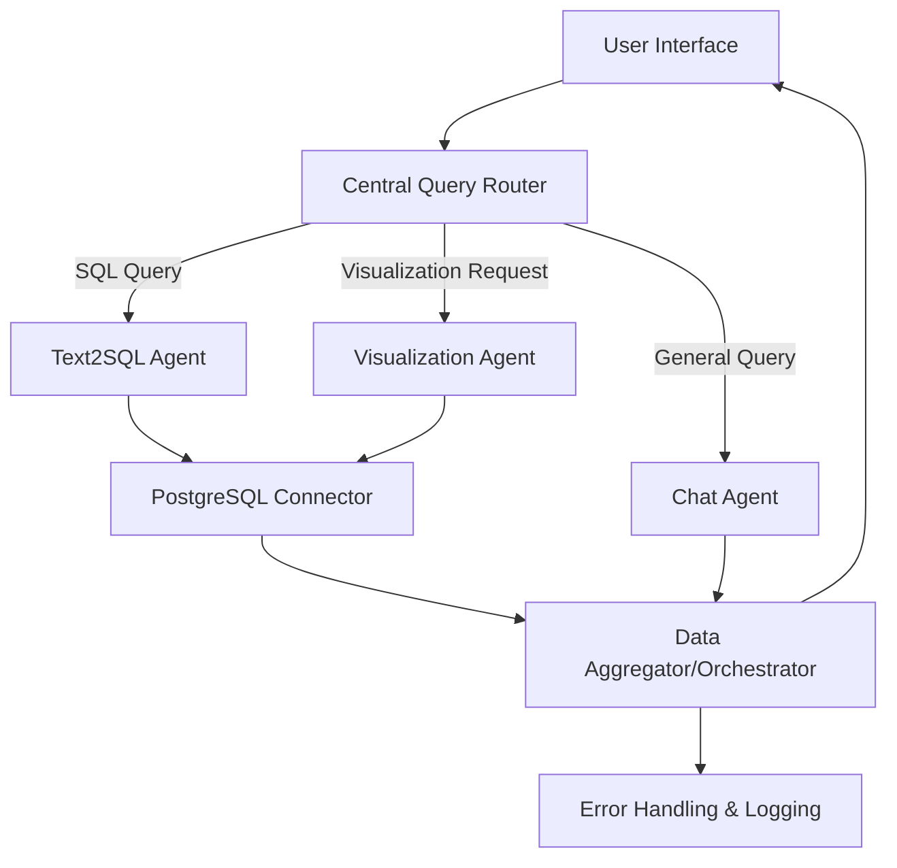

# Design Document: Conversational Data Agent for PostgreSQL

## 1. Introduction

This system is a conversational agent that allows users to interact with a PostgreSQL database using natural language. Similar to Pandas AI—which enhances Pandas DataFrames with generative AI capabilities—this agent interprets user queries and dynamically routes them to specialized modules for:
- **Text2SQL:** Converting natural language to SQL queries.
- **Visualization:** Generating data visualizations from query results.
- **Chat:** Handling general conversational inquiries.

**Key Differentiators from Pandas AI:**
- **Data Source:** Whereas Pandas AI operates directly on Pandas DataFrames, this agent directly accesses a PostgreSQL database.
- **Routing Mechanism:** A dedicated router classifies the intent of each query (text2sql, visualization, or chat) before dispatch.
- **Modularity:** Each capability is encapsulated in its own agent, making it easier to scale or modify specific functionalities.

---

## 2. Objectives

- **User-friendly Data Access:** Allow non-technical users to extract insights from a PostgreSQL database without writing SQL.
- **Dynamic Query Handling:** Automatically detect if a query needs SQL conversion, visualization, or simple chat.
- **Extensibility:** Design a modular system that can later incorporate additional data sources and analysis tools.
- **Security & Robustness:** Ensure safe execution of generated SQL and code, preventing injections and other vulnerabilities.

---

## 3. System Architecture Overview



**Figure:** High-level system flow  

---

## 4. Modules & Components

### 4.1 User Interface (UI)
- **Purpose:** Provide an accessible chat-based interface (web or desktop) where users can submit queries.
- **Technology Options:** Streamlit, Flask (for web-based UIs), or a custom CLI.
- **Responsibilities:**
  - Capture user input.
  - Display aggregated responses (text and visualizations).

### 4.2 Central Query Router
- **Purpose:** Analyze incoming natural language queries to classify intent.
- **Implementation:**
  - Use a lightweight LLM (e.g., GPT‑4o‑mini) with few-shot prompting.
  - Return one of three classifications: *Text2SQL*, *Visualization*, or *Chat*.
- **Example Prompt:**
  ```plaintext
  Determine the intent of this query:
  "Show me a bar chart of monthly revenue for Q1 2025."
  Reply with one of: Text2SQL, Visualization, or Chat.
  ```

### 4.3 Specialized Agents
Each agent is designed to focus on a specific task:

#### a. Text2SQL Agent
- **Role:** Convert natural language queries into executable SQL.
- **Workflow:**
  1. Receive classified query from the Router.
  2. Generate SQL using an LLM with domain-specific prompts.
  3. Validate (and optionally optimize) the SQL.
  4. Send SQL to the PostgreSQL Connector.
- **Security:** Use parameterized queries to mitigate SQL injection.

#### b. Visualization Agent
- **Role:** Create visual representations of data.
- **Workflow:**
  1. Accept either a direct visualization request or data returned from a Text2SQL query.
  2. Use a plotting library (e.g., matplotlib or Plotly) to generate charts.
  3. Return an image or interactive visualization link.

#### c. Chat Agent
- **Role:** Provide conversational responses for general queries.
- **Workflow:**
  1. Use an LLM to generate responses not requiring database interaction.
  2. Optionally prompt for clarifications to steer the user toward more structured queries.

### 4.4 PostgreSQL Connector
- **Purpose:** Securely execute SQL queries against the PostgreSQL database.
- **Implementation:**
  - Use libraries like psycopg2 or SQLAlchemy.
  - Handle connection pooling, error checking, and transaction management.

### 4.5 Aggregator / Orchestrator
- **Purpose:** Combine responses from multiple agents into a single, coherent output.
- **Workflow:**
  1. Receive outputs from Text2SQL/Visualization/Chat agents.
  2. Format and merge results (e.g., a textual summary along with a chart image).
  3. Return the final response to the UI.

### 4.6 Error Handling & Logging Module
- **Purpose:** Capture errors at each step and enable iterative correction.
- **Features:**
  - Logging of agent decisions, SQL queries, and execution results.
  - Error correction prompts for the LLM if SQL generation fails.

---

## 5. Differences from Pandas AI

- **Data Storage:**
  - *Pandas AI:* Operates on in-memory Pandas DataFrames.
  - *Our System:* Operates directly on a PostgreSQL database, enabling real-time, large-scale data analysis.
- **Routing Capability:**
  - *Pandas AI:* Directly processes a DataFrame with a conversational wrapper.
  - *Our System:* Uses a central router to delegate tasks to specialized agents (Text2SQL, Visualization, Chat).
- **Modularity & Extensibility:**
  - Our design explicitly separates concerns into independent modules that can be developed, tested, and scaled individually.
- **Implementation Focus:**
  - Pandas AI primarily converts natural language queries into Python code that manipulates DataFrames.
  - Our approach converts natural language into SQL (or visualization instructions) to interact with a live database.

---

## 6. Implementation Details

### 6.1 Technology Stack
- **Programming Language:** Python 3.8+
- **LLM Provider:** GPT‑4o‑mini (for routing and query conversion); alternative models (OpenAI, BambooLLM, etc.) may be used.
- **Backend Framework:** FastAPI or Flask for building REST endpoints.
- **User Interface:** Streamlit for rapid prototyping of an interactive dashboard.
- **Database:** PostgreSQL with SQLAlchemy or psycopg2.
- **Visualization Libraries:** Matplotlib, Plotly, or Seaborn.
- **Containerization & Deployment:** Docker, Kubernetes for scaling; cloud platforms such as AWS, GCP, or Azure.

### 6.2 Sample Code Snippets

**Router Example:**
```python
import openai

def classify_query(query: str) -> str:
    prompt = f"""
    You are an expert query classifier.
    Determine the intent of this query and respond with one of:
    Text2SQL, Visualization, Chat.
    Query: "{query}"
    """
    response = openai.Completion.create(
        engine="gpt-4o-mini",
        prompt=prompt,
        max_tokens=10,
        temperature=0.2
    )
    return response.choices[0].text.strip()

# Example usage
query = "Show me a bar chart of monthly revenue for Q1 2025."
intent = classify_query(query)
print("Query intent:", intent)
```

**Text2SQL Agent Example:**
```python
def generate_sql(query: str, table: str) -> str:
    prompt = f"""
    Convert the following natural language query into an SQL query.
    Table: {table}
    Query: {query}
    """
    response = openai.Completion.create(
        engine="gpt-4o-mini",
        prompt=prompt,
        max_tokens=150,
        temperature=0.3
    )
    return response.choices[0].text.strip()

# Example usage
nl_query = "List the top 5 countries by revenue."
sql_query = generate_sql(nl_query, "sales_data")
print("Generated SQL:", sql_query)
```

**PostgreSQL Connector Example:**
```python
import psycopg2

def execute_sql(sql_query: str):
    conn = psycopg2.connect(
        dbname="your_db", user="your_user", password="your_password", host="your_host"
    )
    try:
        with conn.cursor() as cur:
            cur.execute(sql_query)
            results = cur.fetchall()
            return results
    finally:
        conn.close()

# Example usage
results = execute_sql(sql_query)
print("SQL Results:", results)
```

### 6.3 Deployment Considerations
- **Docker:** Containerize the entire application (backend API, UI, and LLM integration).
- **API Keys & Secrets:** Securely manage API keys (using environment variables or secret management tools).
- **Scaling:** Use load balancers and horizontal scaling for the backend and database if high query volumes are expected.
- **Monitoring:** Implement logging and monitoring (e.g., using Prometheus and Grafana) to track system performance and errors.


## 7. Conclusion

This design document outlines a modular, scalable conversational agent similar to Pandas AI but optimized for working with a PostgreSQL database. By incorporating a central query router and specialized agents for text-to-SQL conversion, visualization, and general conversation, the system delivers a robust, user-friendly interface for data analysis. 

This design not only replicates key Pandas AI features but also extends them by leveraging the power of SQL for handling large, persistent datasets while ensuring security and scalability.

Would you like additional details on any module or further clarification on the implementation steps?

